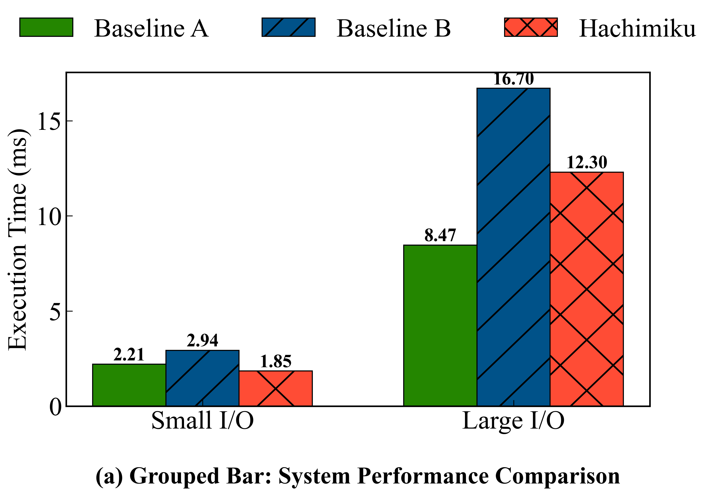
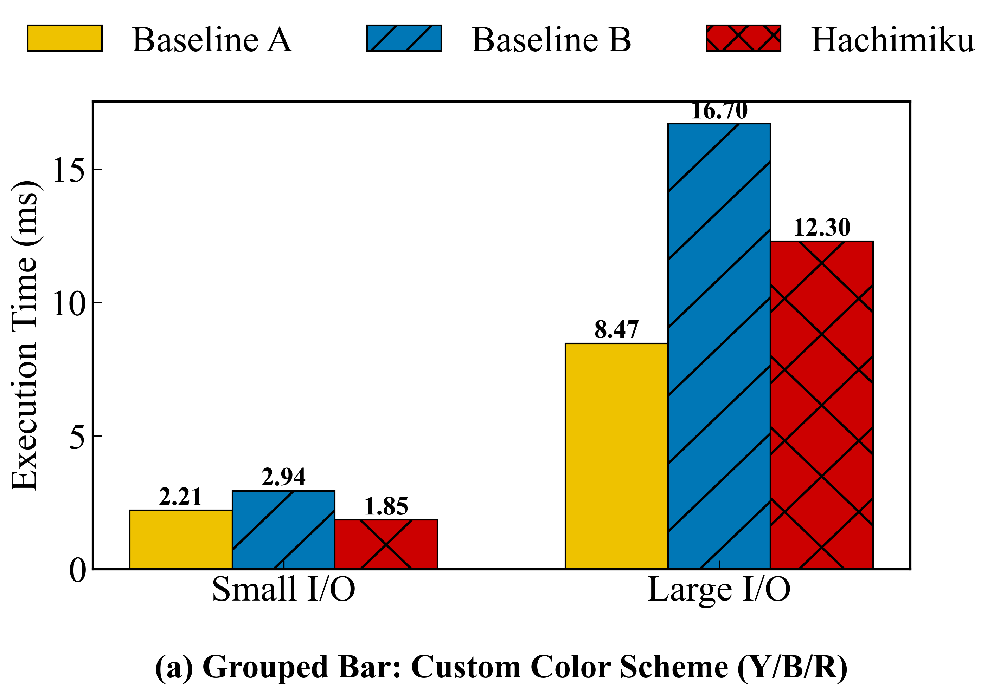
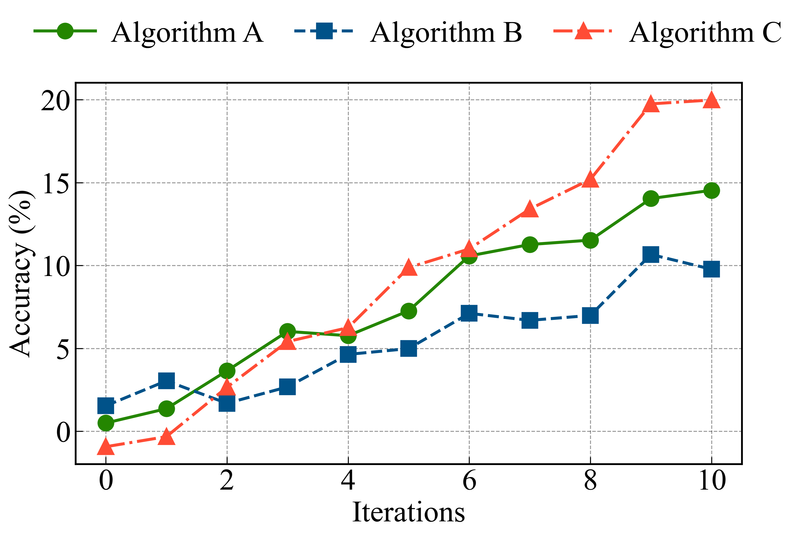
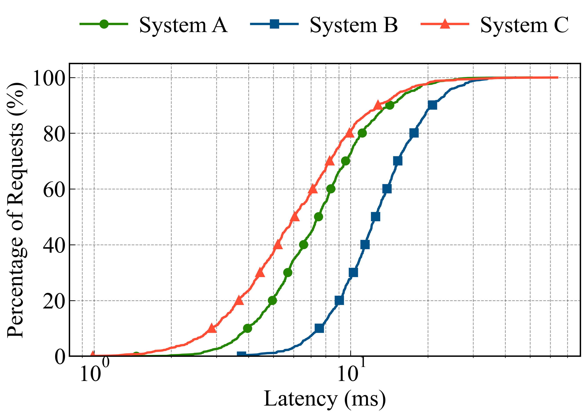
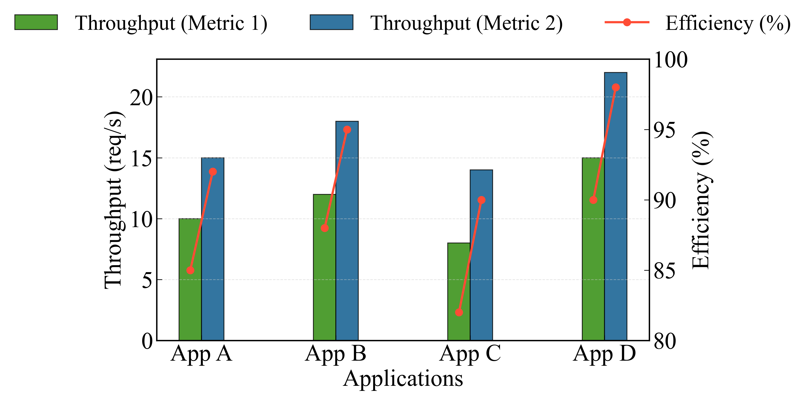
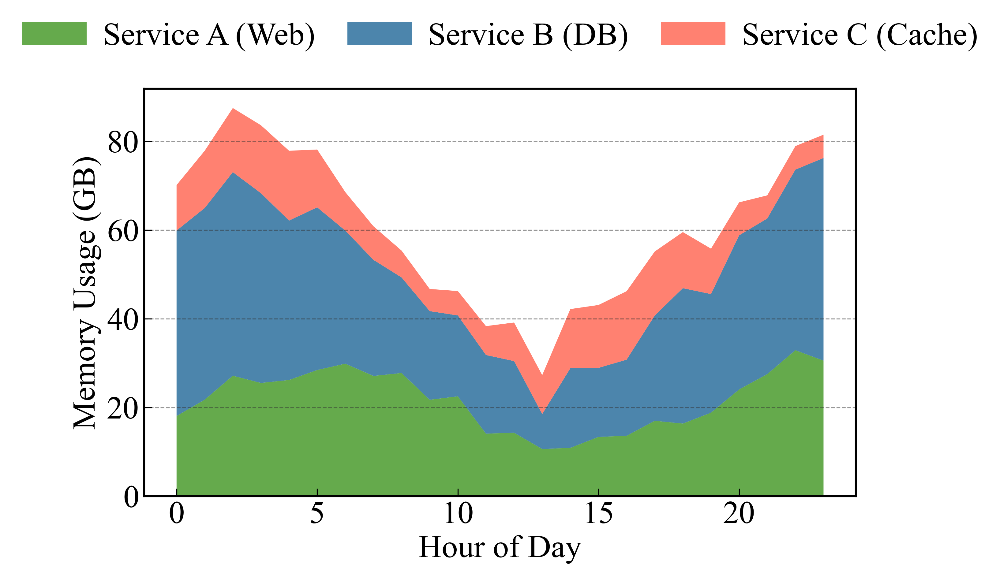
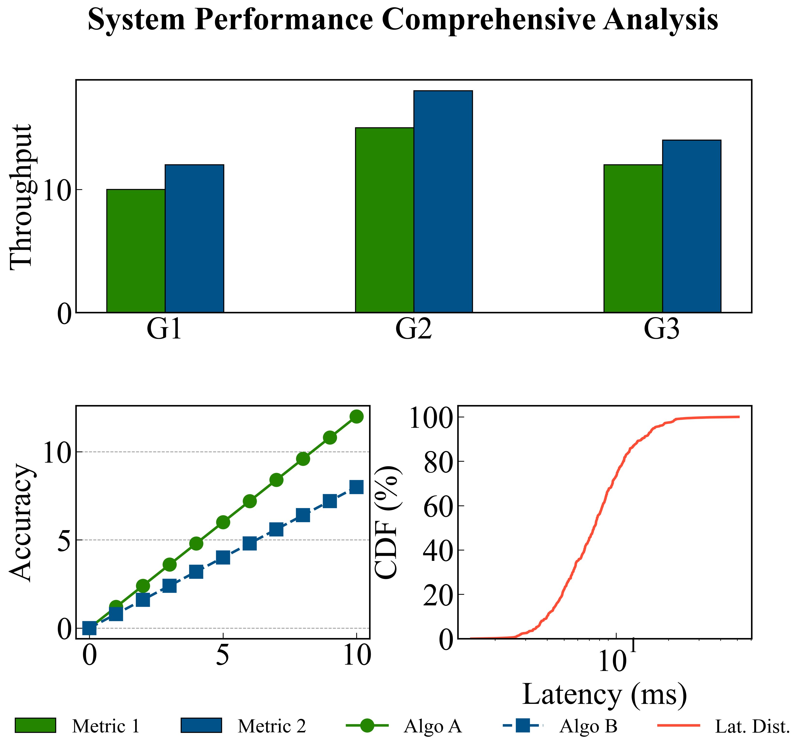

# Hachimiku (哈基-米库) 🍯🎶

<p align="center">
  
</p>

**An Academic Plotting Library**

`hachimiku` is a high-level plotting library built on top of Matplotlib, designed specifically for researchers and students. Named after the sweet fusion of **Honey (Hachi)** and **Miku**, it focuses on "textbook-quality" aesthetics, consistent API design, and professional defaults that work out-of-the-box for top-tier academic publications.

---

## 💎 Core Advantages

### 1. Minimal Code, Paper-Ready Quality
Stop fighting with hundreds of lines of low-level Matplotlib code. `hachimiku` encapsulates years of academic plotting best-practices into simple, high-level API calls. 

**One single call** generates a figure with professional sparse hatches (using our custom engine), auto-scaled fonts, high-contrast colors, and perfectly positioned legends.

#### **With Hachimiku (Approx. 10 lines):**
```python
from hachimiku import BarChart

bc = BarChart(figsize=(10, 6))
bc.create_grouped_bar_chart(
    x_data=['Small I/O', 'Large I/O'],
    y_data_list=[[2.21, 2.94, 1.85], [8.47, 16.70, 12.30]],
    labels=['Baseline A', 'Baseline B', 'Hachimiku'],
    hatch_patterns=['', '/', 'x'],
    manual_hatch=True,        # Use hachimiku's sparse hatch engine
    manual_hatch_gap=2.5,     # Control density by data units
    ylabel='Execution Time (ms)',
    bar_text_format='{:.2f}', # Auto-add values on bars
    title='(a) Grouped Bar: System Performance Comparison'
)
```


#### **Without Hachimiku (Approx. 80-100 lines):**
To achieve the **exact same result** (especially the professional sparse hatching and auto-scaling) in pure Pyplot, you would need to:
1.  **Manual Hatching Engine**: Write a geometry engine to calculate line segments, clip them to bar boundaries using `PathPatch` or `PolyCollection`, and handle slope correction (since Matplotlib's built-in hatch density is fixed and often too dense for papers).
2.  **Smart Legend**: Manually create `ProxyArtists` for the legend to represent the custom hatching correctly, as standard legend handles won't detect the manually drawn lines.
3.  **Auto-Sizing**: Implement logic to detect figure dimensions and DPI to dynamically calculate `fontsize`, `tick_params`, and `linewidth` so the chart looks professional across both PDF and PNG formats.
4.  **Layout Handling**: Manually calculate `bbox_to_anchor` and `subplots_adjust` to ensure the legend doesn't overlap with the title or the chart area.

### 2. Simple Structure, Maximum Customizability
Hachimiku is designed to be **transparent**. Our codebase is modular and simple, avoiding the "black-box" feel of other plotting libraries. 

Every chart type is a clean class, and every aesthetic detail (grid styles, font scaling, color palettes) is exposed through a consistent dictionary-based interface. If our defaults aren't exactly what you need, you can tweak them in seconds.

**Effortless Color Customization:**
Switch from our academic defaults to any custom color scheme (like the classic Yellow/Blue/Red) simply by passing a list.

| Academic Default (Green/Blue/Red) | Custom Scheme (Yellow/Blue/Red) |
|:---:|:---:|
|  |  |

```python
# Effortless customization of styles
bc.create_grouped_bar_chart(
    ...,
    colors=["#eec200", "#0077b6", "#cc0000"],    # Custom Yellow, Blue, Red
    grid_y=True,
    grid_style={'linestyle': ':', 'alpha': 0.3}, # Tweak grids
    top_right_spine_style='none',                # Clean "open" look
    title_y=-0.25                                # Put title below X-axis
)
```

---

## 🌟 Key Features

- **🎨 Professional Academic Palettes**: Default `academic_vivid` theme with high-contrast, publication-ready colors.
- **📈 Comprehensive Chart Types**: Optimized implementations for Bar, Line, CDF, Stacked Area, and Combo charts.
- **🏗️ Powerful Layout Manager**: Create complex figures with multiple subplots using intuitive "mosaic" strings.
- **📏 Manual Hatching System**: Custom-drawn, sparse, and thick textures for bars that remain clear in both color and black-and-white prints.
- **🏷️ Smart Labeling**: Integrated `LabelGenerator` for linear, exponential, power notation, and memory-size labels.
- **📐 Consistent API**: Unified parameter names (`x_data`, `y_data_list`, `colors`, `alpha`) across all modules.
- **🔠 Auto Font Scaling**: Automatically calculates optimal font sizes based on figure dimensions and layout complexity.

---

## 🖼️ Gallery

### 1. Grouped Bar Chart (with Manual Hatching)
Achieve sparse, thick, and professional textures that are impossible with standard Matplotlib hatches.


### 2. Multi-Series Line Chart
High-contrast markers and professional linestyles for clear series differentiation.


### 3. CDF (Cumulative Distribution Function)
Optimized for latency and performance distribution analysis with built-in log-scale support.


### 4. Combo (Bar + Line) Chart
Dual Y-axes with aligned data points and a unified top-level legend.


### 5. Stacked Area Chart
Clean filling with customizable transparency and borders for resource utilization analysis.


### 6. Complex Mosaic Layouts
Arrange multiple different chart types into a single cohesive figure with a shared legend.


---

## 🚀 Quick Start

### Installation
```bash
# Clone the repository
git clone https://github.com/ssk015/hachimiku.git
cd hachimiku
# Install in editable mode
pip install -e .

# (Optional) Generate all README assets with one click
python examples/generate_readme_assets.py
```

### Basic Usage
```python
from hachimiku import BarChart, LineChart

# 1. Create a professional Grouped Bar Chart
bc = BarChart(figsize=(8, 5))
bc.create_grouped_bar_chart(
    x_data=['Small', 'Medium', 'Large'],
    y_data_list=[[10, 12], [15, 18], [12, 14]],
    labels=['System A', 'System B'],
    xlabel='Input Size',
    ylabel='Latency (ms)',
    manual_hatch=True # Enable professional sparse hatching
)

# 2. Create a high-quality Line Chart
lc = LineChart(figsize=(8, 5))
lc.create_line_chart(
    x_data=[1, 2, 3, 4],
    y_data_list=[[1, 4, 9, 16], [1, 2, 3, 4]],
    labels=['Algorithm X', 'Algorithm Y'],
    xlabel='Iterations',
    ylabel='Accuracy (%)'
)
```

---

## 📖 Documentation

Explore detailed guides for each feature:

- [**Bar Chart Reference**](docs/BAR_CHART.md) - Manual hatching, stacked/horizontal bars.
- [**Line Chart Reference**](docs/LINE_CHART.md) - Markers, linestyles, and log scales.
- [**CDF Chart Reference**](docs/CDF_CHART.md) - Distribution analysis.
- [**Combo Chart Reference**](docs/COMBO_CHART.md) - Dual Y-axis Bar + Line.
- [**Area Chart Reference**](docs/AREA_CHART.md) - Stacked filling.
- [**Layout & Subplots**](docs/LAYOUT_AND_SUBPLOTS.md) - Mastering the `LayoutManager`.
- [**Common Features**](docs/COMMON_FEATURES.md) - Colors, legends, spines, and padding.

---

## 🛠️ Requirements
- `matplotlib >= 3.5.0`
- `numpy >= 1.20.0`

## 📄 License
This project is licensed under the [MIT License](LICENSE).

---
*This project was developed with the assistance of Gemini 3 Flash and GPT 5.2.*
(本项目由 Gemini 3 Flash 和 GPT 5.2 协作生成)

