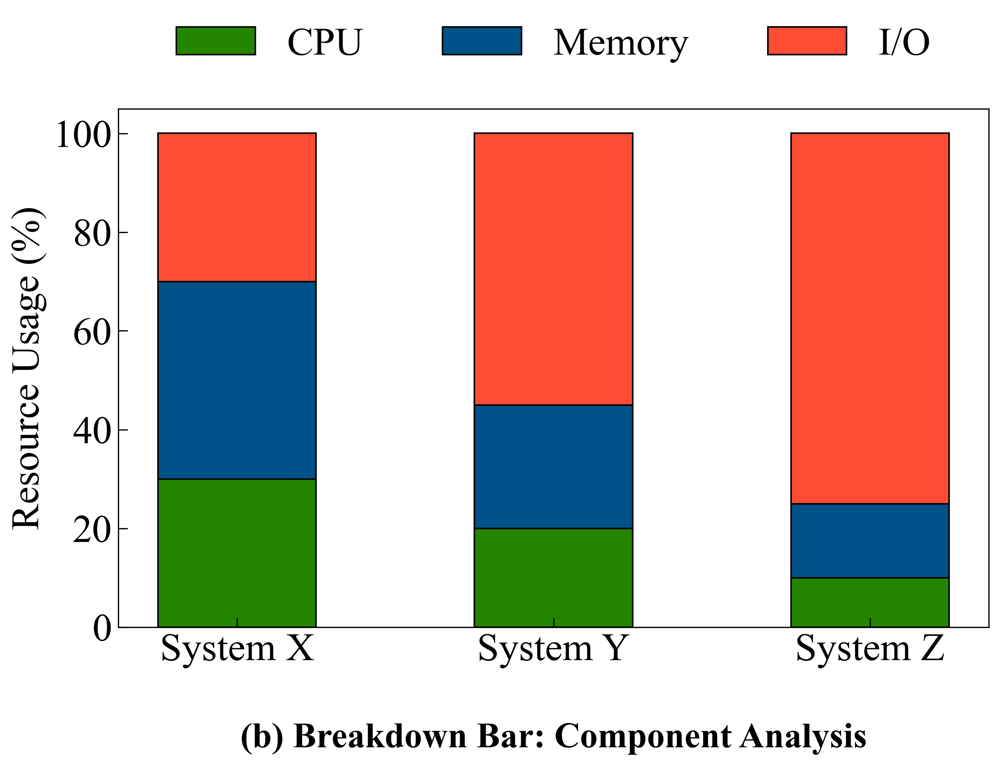
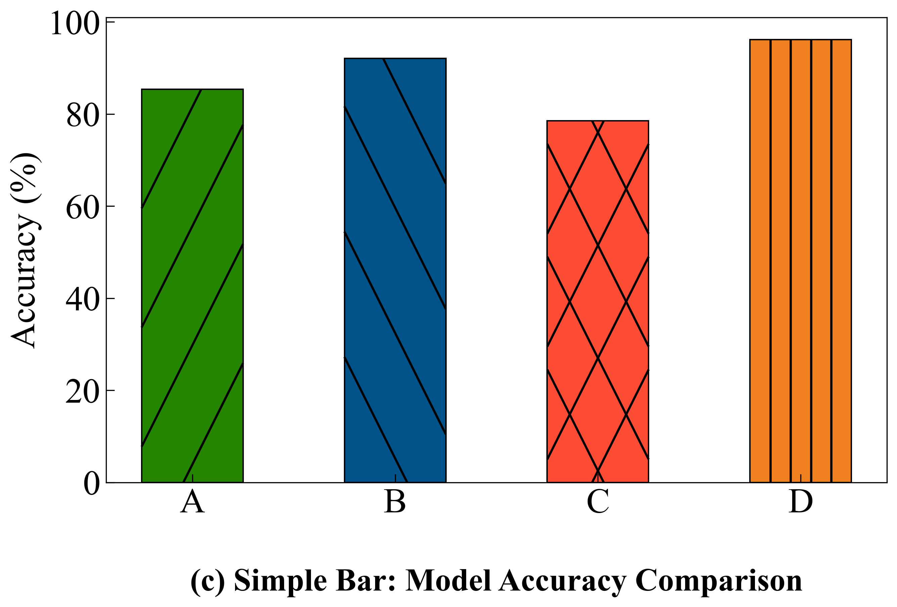
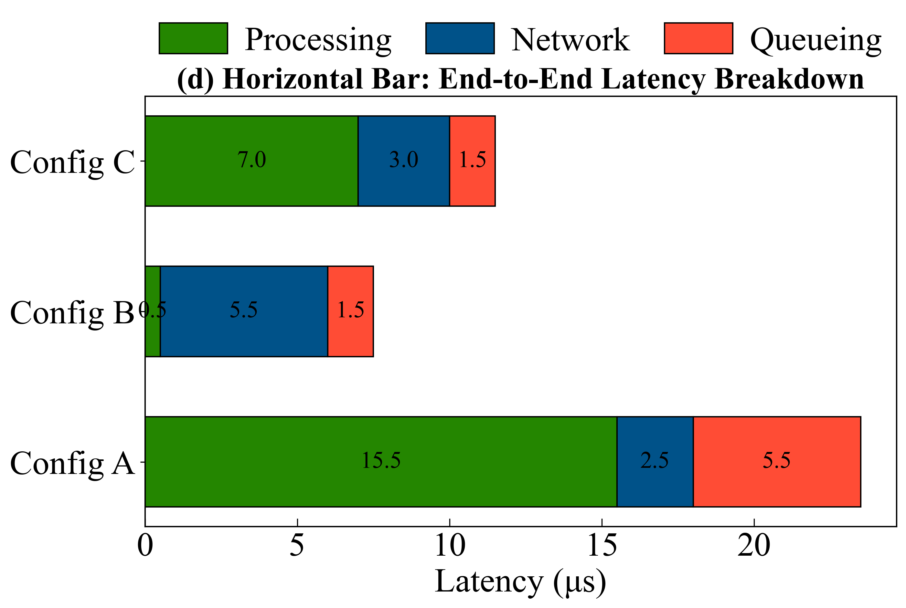

# BarChart Reference Guide

The `BarChart` class provides a high-level API for creating various types of bar charts commonly used in academic papers and technical reports. It supports grouped, stacked (breakdown), simple, and horizontal bar charts with extensive customization options.

## Table of Contents
- [Initialization](#initialization)
- [Bar-Specific Parameters](#bar-specific-parameters)
- [Methods](#methods)
  - [create_grouped_bar_chart](#create_grouped_bar_chart)
  - [create_breakdown_bar_chart](#create_breakdown_bar_chart)
  - [create_simple_bar_chart](#create_simple_bar_chart)
  - [create_horizontal_breakdown_bar_chart](#create_horizontal_breakdown_bar_chart)
- [Advanced Bar Customization](#advanced-bar-customization)
  - [Textbook-Quality Sparse Hatching (Manual Hatch)](#textbook-quality-sparse-hatching-manual-hatch)
  - [Numerical Data Labels](#numerical-data-labels)
  - [Consistent Font Sizes](#consistent-font-sizes)

---

## Initialization

```python
from hachimiku import BarChart

bc = BarChart(figsize=(10, 6))
```

- **`figsize`**: Default figure size (width, height) in inches.

---

## Bar-Specific Parameters

These parameters are unique to `BarChart` and control the physical geometry and annotations of the bars:

| Parameter | Type | Description |
|-----------|------|-------------|
| `bar_width` | `float` | Width of individual bars (relative scale). |
| `bar_spacing` | `float` | Spacing between group centers. |
| `hatch_patterns` | `list` | Fill textures (e.g., `['/', 'x', '\\']`). |
| `manual_hatch` | `bool` | Enable Hachimiku's custom sparse hatching system (Highly Recommended). |
| `manual_hatch_n_lines` | `int` | Fixed number of lines per bar (use for simple charts). |
| `manual_hatch_gap` | `float` | Dynamic spacing: more lines for taller bars (use for variable data). |
| `manual_hatch_slope` | `float` | Slope/angle of diagonal hatches (default 1.0=45°, 2.0=steeper). |
| `manual_hatch_linewidth`| `float` | Thickness of the custom hatch lines. |
| `bar_text_format` | `str` | Format string for auto-labeling (e.g., `'{:.2f}'`). |
| `bar_text_fontsize` | `float` | Font size for bar labels. |
| `bar_text_rotation` | `float` | Rotation angle for bar labels. |

---

## Methods

### `create_grouped_bar_chart`
Groups multiple bars together for comparison across categories.


### `create_breakdown_bar_chart`
Stacks components within a single bar to show parts-to-whole relationships.



### `create_simple_bar_chart`
A basic vertical bar chart for a single sequence. Now supports per-bar colors and automatic hatching.



### `create_horizontal_breakdown_bar_chart`
Horizontal version of the stacked chart, ideal for long labels or latency breakdowns.



---

## Advanced Bar Customization

### Textbook-Quality Sparse Hatching (Manual Hatch)
Standard Matplotlib hatching is often too dense and inflexible for high-quality papers. Hachimiku provides a `manual_hatch` system that draws clean, sparse lines clipped perfectly to each bar.

```python
# To get perfectly sparse, steep, black hatches:
bc.create_grouped_bar_chart(
    ...,
    hatch_patterns=['', '/', 'x'],
    manual_hatch=True,              # Enable the custom system
    manual_hatch_color='black',     # High contrast
    manual_hatch_linewidth=1.6,     # Professional thickness
    manual_hatch_slope=2.0,         # Steeper angle for better look
    manual_hatch_gap=2.5            # Dynamic density based on height
)
```

### Numerical Data Labels
Annotate bars with values automatically. Tick labels on both X and Y axes are automatically scaled to remain readable regardless of figure size.

```python
bc.create_simple_bar_chart(
    ...,
    bar_text_format='{:.1f}%',      # Percentage with 1 decimal
    bar_text_fontweight='bold',
    bar_text_rotation=0,            # Keep text horizontal
    tick_fontsize=14                # Explicit control if needed
)
```

### Consistent Font Sizes
All bar chart types now share the same logic for `auto_fontsize`. This ensures that Y-axis labels and tick marks are consistent across different chart styles in a multi-plot layout.

---

## Examples

See `examples/bar_chart_gallery.py` for the complete source code of the gallery above.
