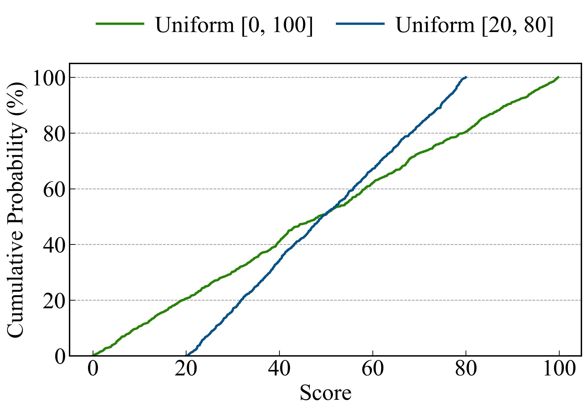

# CDFChart Reference Guide

The `CDFChart` class is designed for visualizing Cumulative Distribution Functions (CDF), which are essential for analyzing data distributions, latency, and performance variability in technical papers.

## Table of Contents
- [Initialization](#initialization)
- [CDF-Specific Parameters](#cdf-specific-parameters)
- [Methods](#methods)
  - [create_cdf_chart](#create_cdf_chart)
  - [create_multi_cdf_chart](#create_multi_cdf_chart)
- [Advanced Customization](#advanced-customization)
  - [Logarithmic X-Axis](#logarithmic-x-axis)
  - [Standard Linear Scale](#standard-linear-scale)

---

## Initialization

```python
from hachimiku import CDFChart

cc = CDFChart(figsize=(10, 6))
```

- **`figsize`**: Default figure size (width, height) in inches.

---

## CDF-Specific Parameters

| Parameter | Type | Description |
|-----------|------|-------------|
| `log_scale_x` | `bool` | Enable logarithmic scale for the X-axis (default: `True`). |
| `markers` | `bool/list` | Enable markers (`True` to use default set, or provide a list). Default: `None` (no markers). |
| `markevery` | `int/list` | Frequency of markers on the line. Essential for CDFs. If `markers` is enabled but `markevery` is not set, a sparse default is used. |
| `grid` | `bool` | Show both X and Y grid lines. |
| `grid_x`, `grid_y` | `bool` | Show only vertical or horizontal grid lines. |
| `ylabel` | `str` | Default is `'CDF (%)'`. |

---

## Methods

### `create_cdf_chart`
Creates a CDF chart where each series can have its own X-data points. You can use markers to distinguish lines even in black-and-white prints.

```python
cc.create_cdf_chart(
    ...,
    markevery=100, # Show a marker every 100 points
    markersizes=8
)
```


### `create_multi_cdf_chart`
Accepts a list of dictionaries for more flexible configuration of individual curves.

---

## Advanced Customization

### Logarithmic X-Axis
Technical data like latency often spans multiple orders of magnitude. The `log_scale_x=True` setting (default) provides a clear view of tail behavior.

```python
cc.create_cdf_chart(
    x_data_list=[x1, x2],
    y_data_list=[y1, y2],
    log_scale_x=True,
    grid=True
)
```

### Standard Linear Scale
For datasets with a narrower range, a linear X-axis can be used.

```python
cc.create_cdf_chart(
    ...,
    log_scale_x=False,
    grid_y=True
)
```



---

## Examples

See `examples/cdf_chart_gallery.py` for the complete source code used to generate the gallery above.
