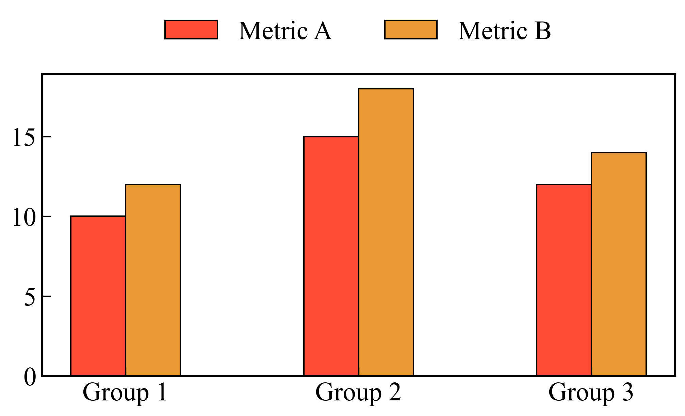
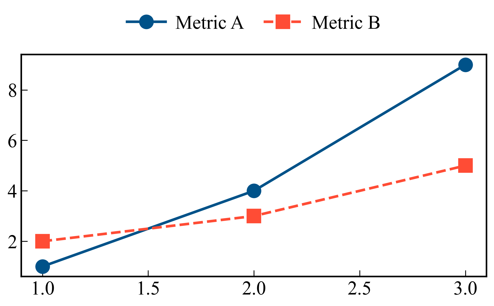
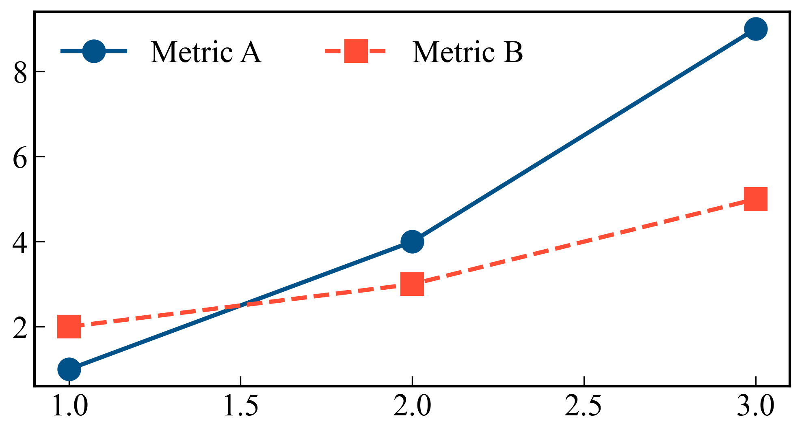
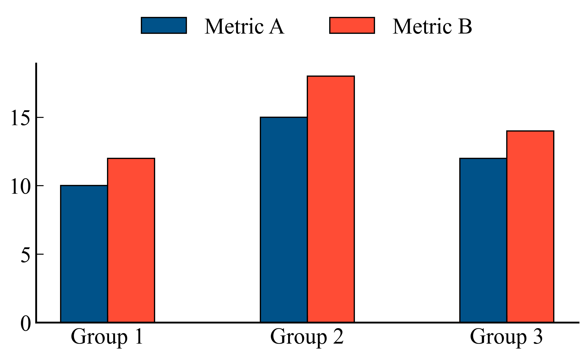
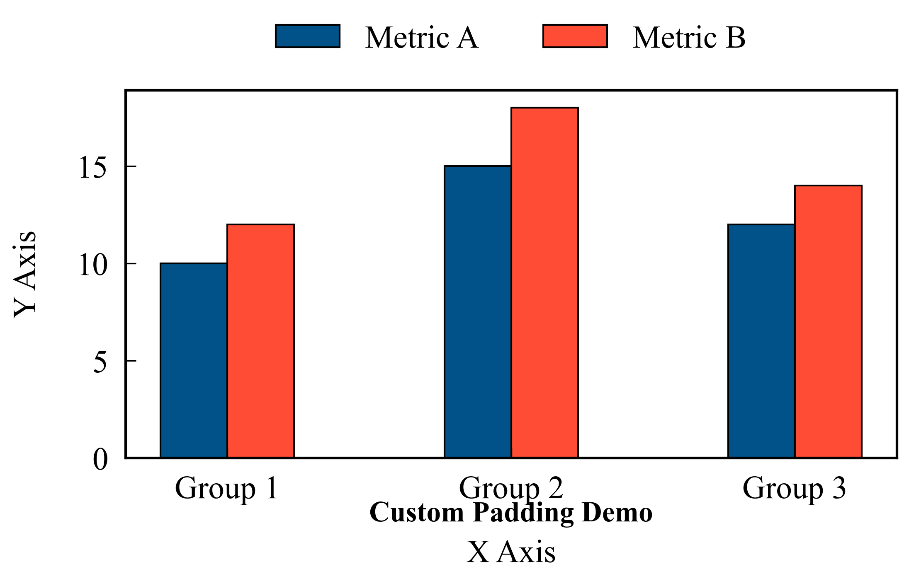
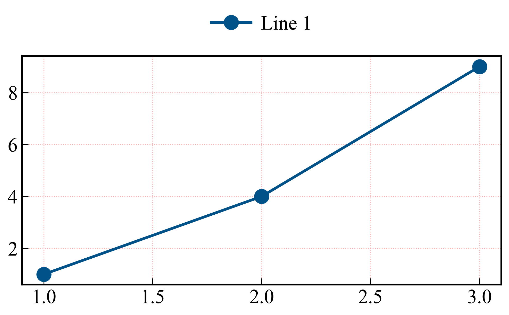

# Common Chart Features Guide

`hachimiku` is designed with a "consistent-by-default" philosophy. Most parameters related to styling, layout, and formatting are shared across all chart types (Bar, Line, CDF, etc.). This guide explains these common features.

## Table of Contents
- [Color Management](#color-management)
- [Legend Placement](#legend-placement)
- [Spine and Border Styles](#spine-and-border-styles)
- [Padding and Positioning](#padding-and-positioning)
- [Grid and Ticks](#grid-and-ticks)
- [Dynamic Font Scaling](#dynamic-font-scaling)

---

## Color Management

All charts support the `color_preset` parameter. The default is `academic_vivid`, which uses high-contrast colors suitable for academic publications.

| Preset | Description |
|--------|-------------|
| `academic_vivid` | **(Default)** Professional sequence (Green, Blue, Red, Orange, etc.) with high contrast. |
| `opt_warm` | Optimized warm tones (Red, Orange, Yellow). |
| `opt_cool` | Optimized cool tones (Blue, Cyan, Purple). |

### Example: academic_vivid vs opt_warm

---

## Legend Placement

By default, `hachimiku` places legends **outside** the plot area (usually at the top) to maximize the data visualization space.

- **`legend_outside`**: Set to `True` (default) or `False`.
- **`legend_loc`**: Standard Matplotlib locations (e.g., `'upper left'`).
- **`legend_ncol`**: Number of columns in the legend.

### Example: Outside vs Inside

---

## Spine and Border Styles

You can control the visibility and style of the top and right "spines" (borders) using `top_right_spine_style`.

- **`top_right_spine_style`**: `'solid'` (default, gray) or `'none'` (clean look).
- **`spine_linewidth`**: Controls the thickness of all axes.

### Example: Standard vs Clean Spines

---

## Padding and Positioning

Academic figures often require precise control over the placement of titles and labels.

- **`title_y`**: Vertical position of the title (e.g., `-0.2` for below the X-axis).
- **`xlabel_pad`, `ylabel_pad`**: Space between labels and axes.
- **`tick_pad`**: Space between tick labels and the axis line.

### Example: Custom Padding and Title Position

---

## Grid and Ticks

- **`grid`, `grid_x`, `grid_y`**: Toggle grid visibility.
- **`grid_style`**: A dictionary of Matplotlib grid properties (e.g., `{'linestyle': '--', 'alpha': 0.5}`).
- **`tick_direction`**: `'in'` (default) or `'out'`.

### Example: Custom Grid Style

---

## Dynamic Font Scaling

One of `hachimiku`'s most powerful features is **automatic font scaling**. It calculates the optimal font size based on:
1.  The `figsize` of the figure.
2.  The number of subplots (if using `LayoutManager`).

This ensures that your labels are always readable, whether you are generating a small single-column figure or a large full-page mosaic. You can still override these using `label_fontsize`, `tick_fontsize`, etc.

---

## Examples

See `examples/common_features_gallery.py` for the code used to generate the demonstrations in this guide.
