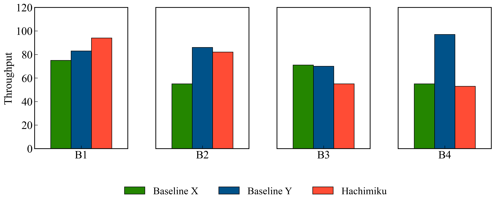

# Figure Layout and Subplots Guide

`hachimiku` provides a powerful `LayoutManager` to create complex figures with multiple subplots. It uses Matplotlib's "mosaic" layout system, allowing you to define layouts using intuitive 2D arrays (lists of lists).

## Table of Contents
- [Basic Concepts](#basic-concepts)
- [Defining a Layout (Mosaic)](#defining-a-layout-mosaic)
- [Configuring Subplots](#configuring-subplots)
- [Creating a Multi-Plot Figure](#creating-a-multi-plot-figure)
- [Shared Legends](#shared-legends)
- [Advanced Adjustments](#advanced-adjustments)

---

## Basic Concepts

The `LayoutManager` acts as a central orchestrator. You provide:
1.  A **mosaic** layout (where each subplot has a unique key).
2.  A **config** list that maps those keys to specific chart types and data.

---

## Defining a Layout (Mosaic)

A mosaic is a list of lists representing a grid. Each string in the mosaic becomes an `ax_key`.

```python
# A top plot 'A' spanning the full width, and two smaller plots 'B' and 'C' below.
mosaic = [
    ['A', 'A'],
    ['B', 'C']
]
```

---

## Configuring Subplots

Each subplot is configured in a dictionary. The `ax_key` must match a key in your mosaic.

```python
config = [
    {
        'type': 'bar',
        'ax_key': 'A',
        'args': {
            'x_data': ['G1', 'G2', 'G3'],
            'y_data_list': [[10, 12], [15, 18], [12, 14]],
            'labels': ['Metric 1', 'Metric 2'],
            'ylabel': 'Throughput'
        }
    },
    {
        'type': 'line',
        'ax_key': 'B',
        'args': {
            'x_data': [1, 2, 3],
            'y_data_list': [[5, 8, 7]],
            'ylabel': 'Accuracy'
        }
    }
    # ... more subplots
]
```

---

## Creating a Multi-Plot Figure

Once configured, use `lm.create_multi_plot` to render the figure.

```python
from hachimiku import LayoutManager

lm = LayoutManager()
lm.create_multi_plot(
    config=config,
    mosaic=mosaic,
    figsize=(12, 10),
    title='Comprehensive System Analysis',
    shared_legend=True,
    save_path='output/my_complex_figure.pdf'
)
```


---

## Example: Grid or Row Layout

You can easily create rows or grids by defining the mosaic accordingly. This example shows four bar charts in a single row, sharing a common legend.

```python
# Define 4 subplots in a single row
mosaic = [['P0', 'P1', 'P2', 'P3']]

config = [
    {
        'type': 'bar',
        'ax_key': f'P{i}',
        'args': {
            'x_data': [f'Bench {i}'],
            'y_data_list': [[val1, val2, val3]],
            'labels': ['X', 'Y', 'Hachimiku'],
            'colors': ["#248600", "#005289", "#ff4c35"],
            'bar_width': 0.35,
            'xlim': (-0.8, 0.8),
            'yticks': [] if i > 0 else None # Fully merge Y-axes (hide ticks and labels)
        }
    } for i in range(4)
]

lm.create_multi_plot(
    config=config,
    mosaic=mosaic,
    figsize=(16, 5),
    shared_legend=True,
    legend_ncol=3,
    legend_bbox_to_anchor=(0.5, -0.15),
    wspace=0.0 # Physically merge subplots
)
```



---

## Shared Legends

If `shared_legend=True`, `LayoutManager` will automatically collect all unique labels across all subplots and create a single unified legend at the bottom of the figure.

- **`legend_ncol`**: Number of columns in the shared legend.
- **`legend_bbox_to_anchor`**: Fine-tune the position of the shared legend.

---

## Advanced Adjustments

- **`hspace`, `wspace`**: Control the vertical and horizontal spacing between subplots.
- **`width_ratios`, `height_ratios`**: Adjust the relative sizes of rows and columns.
- **`top`, `bottom`, `left`, `right`**: Manually adjust figure margins.

### Individual Chart Methods
By default, `LayoutManager` uses the primary method for each chart type (e.g., `create_grouped_bar_chart` for bars). You can specify a different method using the `method` key in the config:

```python
{
    'type': 'bar',
    'ax_key': 'A',
    'method': 'create_breakdown_bar_chart', # Use stacked bars
    'args': { ... }
}
```

---

## Examples

For a complete working example, see `examples/multi_plot_layout_demo.py`.
