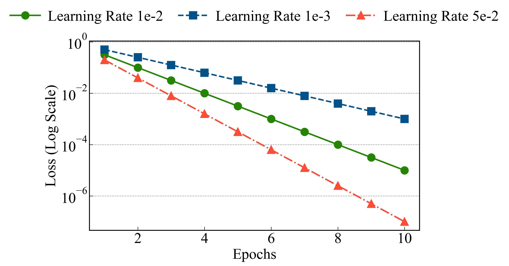
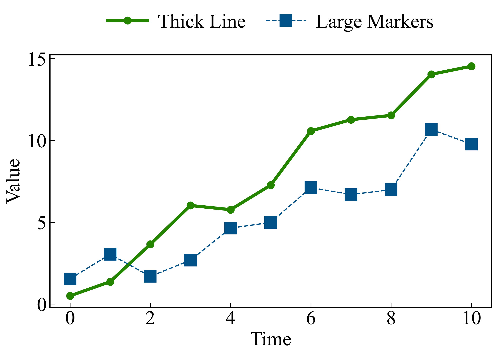

# LineChart Reference Guide

The `LineChart` class provides a high-level API for creating high-quality line charts, common in academic and technical publishing. It features automatic scaling, professional default styles, and support for log-scale axes.

## Table of Contents
- [Initialization](#initialization)
- [Line-Specific Parameters](#line-specific-parameters)
- [Methods](#methods)
  - [create_line_chart](#create_line_chart)
  - [create_multi_line_chart](#create_multi_line_chart)
- [Advanced Customization](#advanced-customization)
  - [Logarithmic Scaling](#logarithmic-scaling)
  - [Custom Markers and Linestyles](#custom-markers-and-linestyles)
  - [Formatting and Grids](#formatting-and-grid)

---

## Initialization

```python
from hachimiku import LineChart

lc = LineChart(figsize=(10, 6))
```

- **`figsize`**: Default figure size (width, height) in inches.

---

## Line-Specific Parameters

These parameters control the appearance of the lines and markers:

| Parameter | Type | Description |
|-----------|------|-------------|
| `markers` | `list` | List of marker symbols (e.g., `['o', 's', '^']`). |
| `linestyles` | `list` | List of linestyles (e.g., `['-', '--', '-.', ':']`). |
| `linewidths` | `float/list` | Thickness of the line(s). |
| `markersizes`| `float/list` | Size of the marker(s). |
| `markevery` | `int/list` | Frequency of markers on the line (e.g., `5` means every 5th point). |
| `log_scale_y` | `bool` | Enable logarithmic scale for the Y-axis. |
| `grid` | `bool` | Show both X and Y grid lines. |
| `grid_x`, `grid_y` | `bool` | Show only vertical or horizontal grid lines. |

---

## Methods

### `create_line_chart`
Creates a standard line chart with multiple data series sharing the same X-axis.


### `create_multi_line_chart`
A more flexible method that takes a list of dataset dictionaries, allowing each line to have its own X-axis or specific per-line properties.

---

## Advanced Customization

### Logarithmic Scaling
Useful for showing exponential growth or decay, or when data spans multiple orders of magnitude.

```python
lc.create_line_chart(
    ...,
    log_scale_y=True,
    grid_y=True # Often helpful with log scales
)
```



### Custom Markers and Linestyles
You can explicitly define how each series should be distinguished.

```python
lc.create_line_chart(
    ...,
    linewidths=[4.0, 1.5],
    markersizes=[8, 14],
    markers=['o', 's'],
    linestyles=['-', '--']
)
```



### Formatting and Grid
Like other chart types, `LineChart` automatically scales font sizes. You can fine-tune the grid appearance using `grid_style`.

```python
lc.create_line_chart(
    ...,
    grid=True,
    grid_style={'linestyle': ':', 'alpha': 0.3}
)
```

---

## Examples

See `examples/line_chart_gallery.py` for the complete source code used to generate the gallery above.
